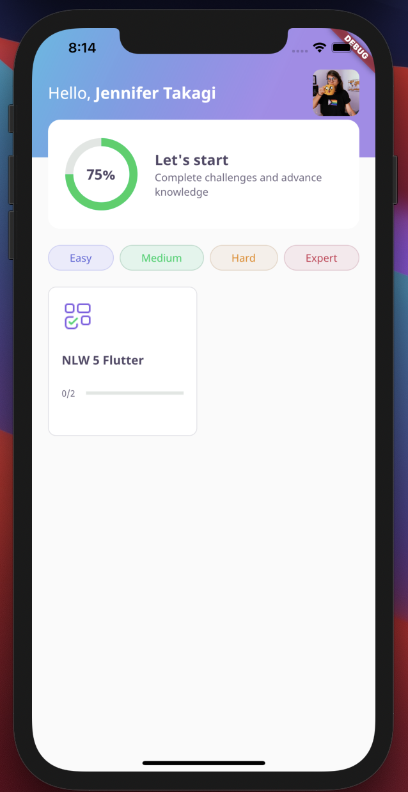

<!-- Inspired by https://github.com/jennifertakagi/dev-quiz -->

<!-- PROJECT SHIELDS -->
[![Contributors][contributors-shield]][contributors-url]
[![Forks][forks-shield]][forks-url]
[![Stargazers][stars-shield]][stars-url]
[![Issues][issues-shield]][issues-url]
[![MIT License][license-shield]][license-url]
[![LinkedIn][linkedin-shield]][linkedin-url]


<!-- PROJECT LOGO -->
<br />
<p align="center">
  <a href="https://github.com/jennifertakagi/dev-quiz">
    
  </a>

  <h3 align="center">Dev Quiz</h3>

  <p align="center">
    Discover your knowledge as a dev 🕵️!
    <br />
    <a href="https://github.com/jennifertakagi/dev-quiz"><strong>Explore the docs »</strong></a>
    <br />
    <br />
    <a href="https://github.com/jennifertakagi/dev-quiz/issues">Report Bug</a>
    ·
    <a href="https://github.com/jennifertakagi/dev-quiz/issues">Request Feature</a>
  </p>
</p>


<!-- TABLE OF CONTENTS -->
<details open="open">
  <summary>Table of Contents</summary>
  <ol>
    <li>
      <a href="#about-the-project">About The Project</a>
      <ul>
        <li><a href="#built-with">Built With</a></li>
      </ul>
    </li>
    <li>
      <a href="#getting-started">Getting Started</a>
      <ul>
        <li><a href="#prerequisites">Prerequisites</a></li>
        <li><a href="#installation">Installation</a></li>
      </ul>
    </li>
    <li><a href="#roadmap">Roadmap</a></li>
    <li><a href="#contributing">Contributing</a></li>
    <li><a href="#license">License</a></li>
    <li><a href="#contact">Contact</a></li>
  </ol>
</details>


<!-- ABOUT THE PROJECT -->
## About The Project

 

A mobile application to test your knowledge as a dev 🕵️!

Features:
* Answer tech questions
* Check if you are correct
* Sum points


### Built With

* [Flutter](https://flutter.dev/)
* [Cupertino Icons](https://pub.dev/packages/cupertino_icons)
* [Share Plus](https://pub.dev/packages/share_plus)


<!-- GETTING STARTED -->
## Getting Started

### Prerequisites

* [Fluter](https://flutter.dev/docs/get-started/install)


### Installation

1. Clone the repo
   ```sh
   git clone https://github.com/jennifertakagi/dev-quiz.git
   ```
2. Run locally
   ```sh
   open -a Simulator
   ```
3. Open the debugger of VSCode to an cool experience


<!-- ROADMAP -->
## Roadmap

See the [open issues](https://github.com/jennifertakagi/dev-quiz/issues) for a list of proposed features (and known issues.


<!-- CONTRIBUTING -->
## Contributing

Contributions are what make the open source community such an amazing place to be learn, inspire, and create. Any contributions you make are **greatly appreciated**.

1. Fork the Project
2. Create your Feature Branch (`git checkout -b feature/AmazingFeature`)
3. Commit your Changes (`git commit -m 'Add some AmazingFeature'`)
4. Push to the Branch (`git push origin feature/AmazingFeature`)
5. Open a Pull Request


<!-- LICENSE -->
## License

Distributed under the MIT License. See `LICENSE` for more information.


<!-- CONTACT -->
## Contact

Jennifer Takagi - [@jennitakagi](https://twitter.com/jennitakagi)


<!-- MARKDOWN LINKS & IMAGES -->
<!-- https://www.markdownguide.org/basic-syntax/#reference-style-links -->
[contributors-shield]: https://img.shields.io/github/contributors/jennifertakagi/dev-quiz.svg?style=for-the-badge
[contributors-url]: https://github.com/jennifertakagi/dev-quiz/graphs/contributors
[forks-shield]: https://img.shields.io/github/forks/jennifertakagi/dev-quiz.svg?style=for-the-badge
[forks-url]: https://github.com/jennifertakagi/dev-quiz/network/members
[stars-shield]: https://img.shields.io/github/stars/jennifertakagi/dev-quiz.svg?style=for-the-badge
[stars-url]: https://github.com/jennifertakagi/dev-quiz/stargazers
[issues-shield]: https://img.shields.io/github/issues/jennifertakagi/dev-quiz.svg?style=for-the-badge
[issues-url]: https://github.com/jennifertakagi/dev-quiz/issues
[license-shield]: https://img.shields.io/github/license/jennifertakagi/dev-quiz.svg?style=for-the-badge
[license-url]: https://github.com/jennifertakagi/dev-quiz/blob/master/LICENSE.txt
[linkedin-shield]: https://img.shields.io/badge/-LinkedIn-black.svg?style=for-the-badge&logo=linkedin&colorB=555
[linkedin-url]: https://linkedin.com/in/jennifertakagi
[product-screenshot]: docs/screenshot.png